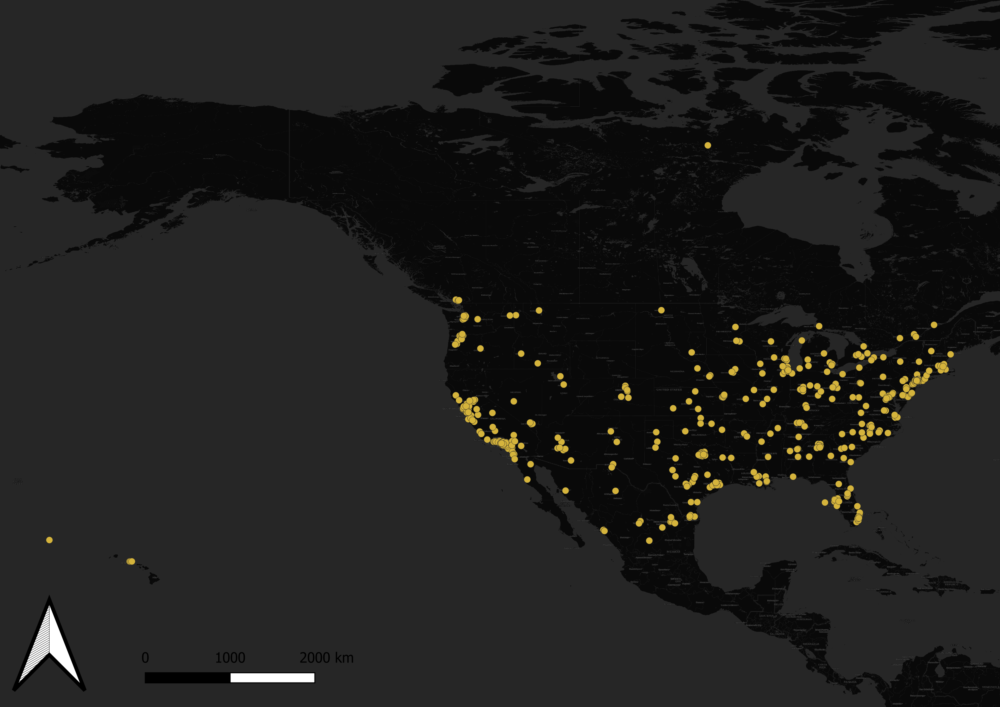

# Tweets Collected from keyword "election"

While there is an assumed fair distribution of tweets about the election around the country at first glance, it can be observed that data is a lot denser on the east side as compared to the west. This shows how the data shown can be correlated to the recent riot at the Capitol. Many individuals might raise more concern about the issue as compared to the west because the proximity makes them more likely to be affected by this. More specifically, it is extremely dense at the approximate area where the riot has occurred. It can be assumed that individuals located close to the area where the riot occurred are a lot more active about sharing their thoughts (whether it is to support or shame the rioters).

There are also some data found in Mexico which might be related to the fact that the election of a new president can change policies regarding the Mexico-United States border. Given how Trump was very stern about his approach on restricting Mexicans from crossing the borders, the election might give them hope to, for instance, reunite with their families. Among other reasons, Biden’s presidency might spark some positive results for them. These data found in Mexico shows how the United States of America’s election can have an impact on some individuals living there.
